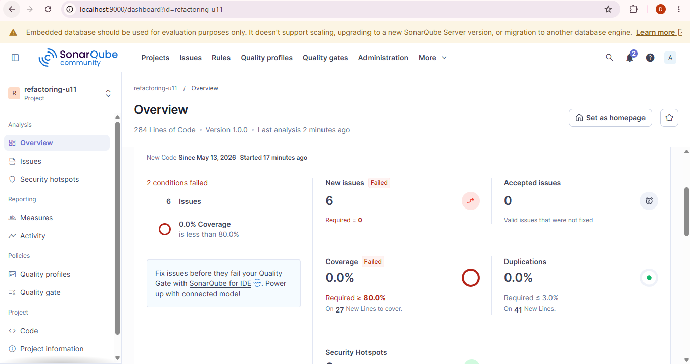

# Carreño-Post1-U11

**Patrones de Diseño de Software — Unidad 11: Refactorización Avanzada y Clean Code Profundo**
Universidad de Santander (UDES) · Ingeniería de Sistemas · 2026

---

## Objetivo

Identificar *code smells* de tipo **Bloater** (Long Method, Large Class, Primitive Obsession) en un servicio Spring Boot y eliminarlos aplicando las técnicas **Extract Method**, **Extract Class** e introducción de **Value Objects**, verificando con SonarQube que la complejidad ciclomática disminuye y la mantenibilidad mejora.

---

## Estructura del proyecto

```
src/
└── main/
    └── java/com/universidad/refactoringu11/
        ├── domain/
        │   ├── CodigoDescuento.java
        │   ├── DatosCliente.java
        │   ├── Direccion.java
        │   ├── LineaPedido.java
        │   ├── Pedido.java
        │   └── Producto.java
        ├── repository/
        │   └── PedidoRepository.java
        └── service/
            ├── NotificacionService.java
            └── PedidoService.java
```

---

## Code Smells identificados (código original)

| # | Smell | Ubicación | Descripción |
|---|-------|-----------|-------------|
| 1 | **Long Method** | `PedidoService.procesarPedido()` | Un único método de ~40 líneas que valida, calcula, aplica descuentos, notifica y persiste |
| 2 | **Large Class** | `PedidoService` | La clase concentra validación de cliente, lógica de negocio, notificaciones y persistencia |
| 3 | **Primitive Obsession / Data Clump** | Parámetros de `procesarPedido()` | 7 primitivos sueltos representando datos del cliente (`nombre`, `email`, `telefono`, `direccion`, `ciudad`, `codigoPostal`, `clienteId`) |
| 4 | **Field Injection** | `@Autowired private PedidoRepository repo` | Inyección de dependencia en campo, dificulta pruebas unitarias |

---

## Técnicas de refactorización aplicadas

### 1. Introduce Value Object — `DatosCliente` y `Direccion`

Los 6 parámetros primitivos del cliente se agruparon en la clase inmutable `DatosCliente`, que a su vez contiene un objeto `Direccion`. Ambas clases validan sus invariantes en el constructor, eliminando la necesidad de validar en el servicio.

```java
public class DatosCliente {
    private final String nombre;
    private final String email;
    private final String telefono;
    private final Direccion direccion;

    public DatosCliente(String nombre, String email,
                        String telefono, Direccion direccion) {
        if (nombre == null || nombre.isBlank())
            throw new IllegalArgumentException("Nombre requerido");
        if (email == null || !email.contains("@"))
            throw new IllegalArgumentException("Email inválido");
        this.nombre = nombre;
        this.email  = email;
        this.telefono  = telefono;
        this.direccion = direccion;
    }
    // getters, equals, hashCode — sin setters (inmutable)
}
```

**Beneficio:** La firma de `procesarPedido()` se redujo de 11 parámetros a 5. La validación está encapsulada y reutilizable.

---

### 2. Extract Method — reducción del Long Method

`procesarPedido()` se dividió en métodos privados con responsabilidad única, cada uno con CC = 1 o 2:

```java
public String procesarPedido(DatosCliente cliente,
                              LineaPedido[] lineas,
                              String metodoPago,
                              boolean esUrgente,
                              CodigoDescuento descuento) {
    double total             = calcularTotal(lineas);
    double totalConDescuento = aplicarDescuento(total, descuento);
    notificarCliente(cliente, esUrgente);
    return persistirPedido(cliente, totalConDescuento);
}

private double calcularTotal(LineaPedido[] lineas) {
    return Arrays.stream(lineas)
            .mapToDouble(l -> l.getPrecioUnitario() * l.getCantidad())
            .sum();
}

private double aplicarDescuento(double total, CodigoDescuento d) {
    return d != null ? total * (1 - d.getPorcentaje()) : total;
}
```

**Beneficio:** `procesarPedido()` quedó con 4 líneas de cuerpo (CC = 1). Cada método extraído es legible, testeable y tiene una sola razón de cambio.

---

### 3. Extract Class — separación de responsabilidades

La lógica de notificación al cliente no pertenece a `PedidoService`. Se extrajo a `NotificacionService`, y `PedidoService` se refactorizó para usar inyección por constructor:

```java
@Service
public class NotificacionService {
    public void notificarPedido(DatosCliente cliente, boolean urgente) {
        // lógica de email / SMS
    }
}

@Service
public class PedidoService {
    private final PedidoRepository repo;
    private final NotificacionService notificacion;

    public PedidoService(PedidoRepository repo,
                         NotificacionService notificacion) {
        this.repo         = repo;
        this.notificacion = notificacion;
    }
}
```

**Beneficio:** Se respeta el Principio de Responsabilidad Única (SRP). `NotificacionService` puede evolucionar de forma independiente y es fácilmente mockeable en pruebas.

---

## Métricas SonarQube — Antes vs. Después

| Métrica | Antes (código original) | Después (refactorizado) | Mejora |
|---------|------------------------|-------------------------|--------|
| CC de `procesarPedido()` | ~8 | 1 | ↓ 87 % |
| Code Smells totales | _ver captura_ | _ver captura_ | ↓ notable |
| Technical Debt Ratio (TDR) | _ver captura_ | _ver captura_ | ↓ |
| Líneas de `procesarPedido()` | ~40 | ≤ 8 | ↓ 80 % |
| Parámetros de entrada | 11 | 5 | ↓ 55 % |

> 📸 **Capturas del dashboard de SonarQube:**

**Antes de la refactorización:**



**Después de la refactorización:**


---

## Prerrequisitos para ejecutar el proyecto

```bash
# Levantar SonarQube
docker run -d --name sonarqube -p 9000:9000 sonarqube:community

# Compilar y analizar
mvn verify sonar:sonar \
  -Dsonar.host.url=http://localhost:9000 \
  -Dsonar.token=TU_TOKEN \
  -Dsonar.projectKey=refactoring-u11
```

- Java 17+
- Maven 3.9+
- Docker Desktop

---